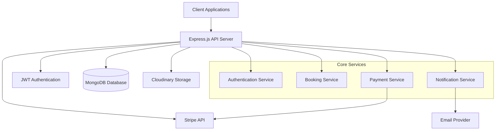
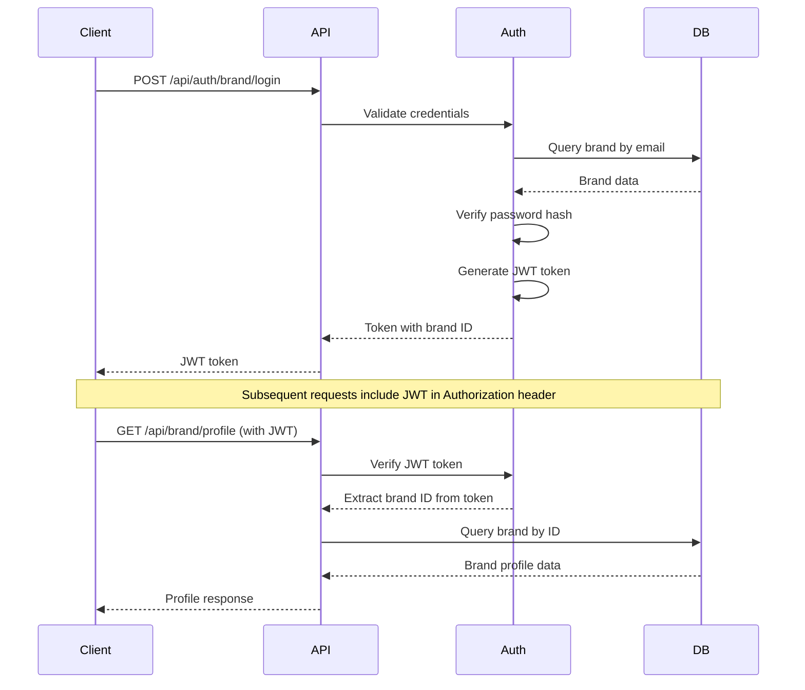
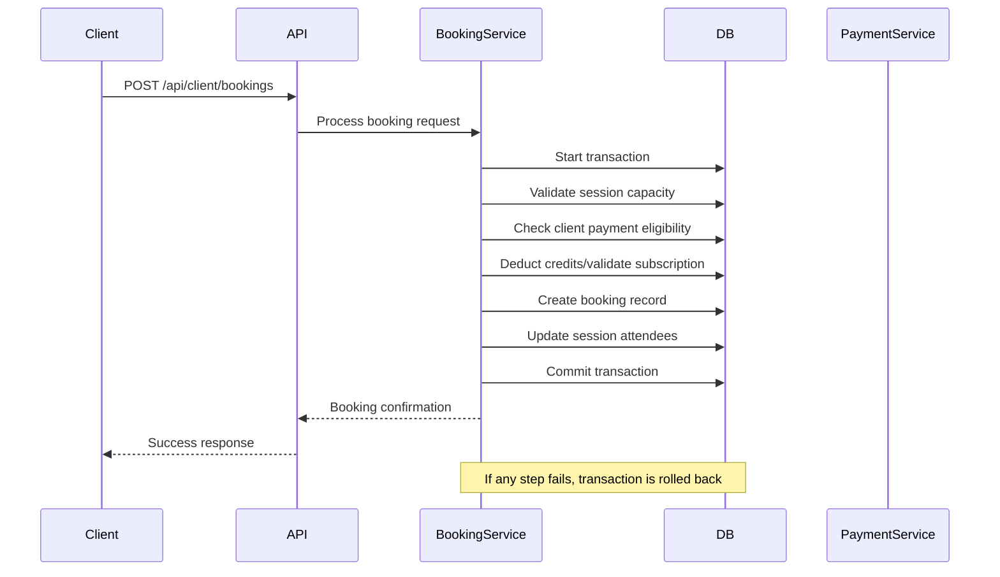
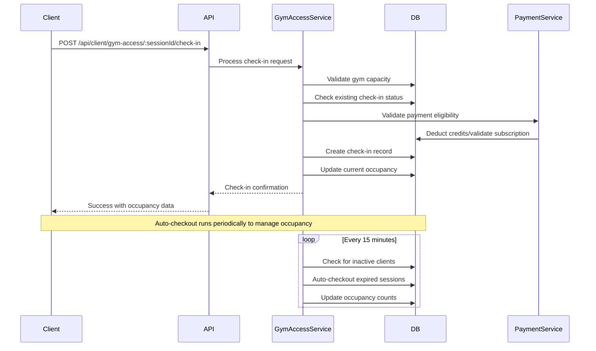

# Design Document

## Overview

The fitness booking platform is a multi-brand SaaS application that enables fitness businesses to manage their classes, sessions, and client bookings while providing clients with a unified interface to discover and book fitness services. The platform implements a direct payment model where each brand receives payments directly to their Stripe account, eliminating platform fees for the MVP.

The system supports two primary booking models:
- **Credit-based**: Clients purchase credit packages and use credits to book individual sessions
- **Subscription-based**: Clients subscribe to plans with frequency limits and class access restrictions

The platform supports two distinct class types:
- **Scheduled Classes**: Fixed-capacity classes with pre-booking and specific time slots (e.g., yoga, pilates)
- **Gym Access Classes**: Dynamic-capacity facility access with real-time occupancy tracking and flexible check-in/check-out

## Architecture

### High-Level Architecture



### Technology Stack

- **Runtime**: Node.js (v18+) with TypeScript
- **Framework**: Express.js with middleware for security, CORS, and rate limiting
- **Database**: MongoDB with Mongoose ODM
- **Authentication**: JWT tokens with bcrypt password hashing
- **Payments**: Stripe Connect for direct brand payments
- **File Storage**: Cloudinary for image uploads
- **Validation**: Joi for input validation and sanitization

### API Architecture Patterns

#### Authentication Flow


#### Booking Transaction Flow


#### Gym Access Check-In Flow


## Components and Interfaces

### Core Models and Relationships

#### Brand Management
```typescript
interface Brand {
  _id: ObjectId;
  name: string;
  email: string;
  password: string; // bcrypt hashed
  description?: string;
  logo?: string;
  address: Address;
  contact: ContactInfo;
  businessHours: BusinessHour[];
  stripeConnectAccountId?: string;
  stripeOnboardingComplete: boolean;
  status: 'active' | 'inactive';
  createdAt: Date;
  updatedAt: Date;
}

interface Class {
  _id: ObjectId;
  name: string;
  brand: ObjectId; // Brand reference
  description: string;
  category: string;
  difficulty: 'beginner' | 'intermediate' | 'advanced';
  slots: number;
  duration: number; // minutes
  cancellationPolicy: number; // hours
  timeBlocks: TimeBlock[];
  status: 'active' | 'inactive';
  
  // Gym Access Fields
  classType: 'scheduled' | 'open-access';
  autoCheckoutDuration?: number; // minutes - for open-access only
  allowWalkIns?: boolean; // for open-access only
}

interface Session {
  _id: ObjectId;
  class: ObjectId; // Class reference
  dateTime: Date;
  capacity: number;
  attendees: SessionAttendee[];
  status: 'scheduled' | 'in-progress' | 'completed' | 'cancelled';
  
  // Gym Access Fields (for open-access sessions only)
  currentOccupancy?: number; // real-time count of checked-in clients
  checkIns?: CheckInRecord[]; // detailed check-in/check-out tracking
}

interface CheckInRecord {
  client: ObjectId;
  checkInTime: Date;
  checkOutTime?: Date; // null = still checked in
  bookingId?: ObjectId; // optional - might be walk-in
  bookingType: 'credits' | 'subscription';
  autoCheckedOut: boolean; // true if system auto-checked out
}
```

#### Client and Booking Management
```typescript
interface Client {
  _id: ObjectId;
  email: string;
  password: string; // bcrypt hashed
  firstName: string;
  lastName: string;
  phone?: string;
  profilePhoto?: string;
  preferences: ClientPreferences;
  brands: ObjectId[]; // Associated brands
  status: 'active' | 'inactive';
}

interface Booking {
  _id: ObjectId;
  client: ObjectId;
  session: ObjectId;
  bookingType: 'credits' | 'subscription';
  status: 'pending' | 'confirmed' | 'completed' | 'cancelled';
  creditTransactionId?: ObjectId;
  subscriptionId?: ObjectId;
  confirmationDate?: Date;
  cancellationDate?: Date;
}

interface ClientInvitation {
  _id: ObjectId;
  brand: ObjectId;
  clientEmail: string;
  invitationToken: string;
  status: 'pending' | 'accepted' | 'declined' | 'expired';
  expiryDate: Date;
  sentDate: Date;
  responseDate?: Date;
  message?: string;
}
```

#### Payment and Plan Management
```typescript
interface SubscriptionPlan {
  _id: ObjectId;
  brand: ObjectId;
  name: string;
  price: number; // cents
  billingCycle: 'monthly' | 'quarterly' | 'yearly';
  includedClasses: ObjectId[]; // empty = all classes
  frequencyLimit: FrequencyLimit;
  status: 'active' | 'inactive';
}

interface CreditPlan {
  _id: ObjectId;
  brand: ObjectId;
  name: string;
  price: number; // cents
  creditAmount: number;
  validityPeriod: number; // days
  bonusCredits: number;
  includedClasses: ObjectId[];
  status: 'active' | 'inactive';
}

interface CreditBalance {
  _id: ObjectId;
  client: ObjectId;
  brand: ObjectId;
  availableCredits: number;
  creditPackages: CreditPackage[];
  status: 'active' | 'expired';
}
```

### Service Layer Architecture

#### Authentication Service
```typescript
class AuthenticationService {
  async registerBrand(data: BrandRegistrationData): Promise<Brand>;
  async loginBrand(email: string, password: string): Promise<{ brand: Brand; token: string }>;
  async registerClient(data: ClientRegistrationData): Promise<Client>;
  async loginClient(email: string, password: string): Promise<{ client: Client; token: string }>;
  async verifyToken(token: string): Promise<{ id: string; type: 'brand' | 'client' }>;
  async refreshToken(token: string): Promise<string>;
}
```

#### Booking Service
```typescript
class BookingService {
  async createBooking(clientId: string, sessionId: string, bookingType: BookingType): Promise<Booking>;
  async cancelBooking(bookingId: string, cancelledBy: string): Promise<Booking>;
  async validateBookingEligibility(clientId: string, sessionId: string): Promise<BookingEligibility>;
  async processCreditsBooking(clientId: string, sessionId: string): Promise<Booking>;
  async processSubscriptionBooking(clientId: string, sessionId: string): Promise<Booking>;
  async restoreCreditsOnCancellation(booking: Booking): Promise<void>;
}
```

#### Gym Access Service
```typescript
class GymAccessService {
  async checkInClient(clientId: string, sessionId: string, bookingType?: BookingType): Promise<CheckInRecord>;
  async checkOutClient(clientId: string, sessionId: string): Promise<CheckInRecord>;
  async getCurrentOccupancy(sessionId: string): Promise<{ current: number; capacity: number; percentage: number }>;
  async autoCheckoutInactiveClients(sessionId: string): Promise<CheckInRecord[]>;
  async validateGymCapacity(sessionId: string): Promise<boolean>;
  async getClientCheckInStatus(clientId: string, sessionId: string): Promise<CheckInRecord | null>;
  async processWalkInAccess(clientId: string, sessionId: string, bookingType: BookingType): Promise<CheckInRecord>;
}
```

#### Payment Service
```typescript
class PaymentService {
  async createSubscription(clientId: string, planId: string): Promise<{ subscription: Subscription; paymentIntent: Stripe.PaymentIntent }>;
  async purchaseCreditPlan(clientId: string, planId: string): Promise<{ creditBalance: CreditBalance; paymentIntent: Stripe.PaymentIntent }>;
  async handleStripeWebhook(event: Stripe.Event): Promise<void>;
  async connectBrandStripeAccount(brandId: string): Promise<string>; // Returns connect URL
  async checkStripeAccountStatus(brandId: string): Promise<StripeAccountStatus>;
}
```

### API Route Structure

#### Brand Routes
```typescript
// Authentication
POST   /api/auth/brand/register
POST   /api/auth/brand/login
POST   /api/auth/brand/refresh

// Profile Management
GET    /api/brand/profile
PUT    /api/brand/profile

// Class Management
GET    /api/brand/classes
POST   /api/brand/classes
PUT    /api/brand/classes/:id
DELETE /api/brand/classes/:id

// Session Management
GET    /api/brand/sessions
POST   /api/brand/sessions
PUT    /api/brand/sessions/:id
DELETE /api/brand/sessions/:id
POST   /api/brand/sessions/bulk-create

// Booking Management
GET    /api/brand/bookings
PUT    /api/brand/bookings/:id/status

// Client Invitation Management
GET    /api/brand/invitations
POST   /api/brand/invitations
PUT    /api/brand/invitations/:id/resend
DELETE /api/brand/invitations/:id

// Payment Plans
GET    /api/brand/subscription-plans
POST   /api/brand/subscription-plans
PUT    /api/brand/subscription-plans/:id
DELETE /api/brand/subscription-plans/:id

GET    /api/brand/credit-plans
POST   /api/brand/credit-plans
PUT    /api/brand/credit-plans/:id
DELETE /api/brand/credit-plans/:id

// Stripe Integration
POST   /api/brand/stripe/connect
GET    /api/brand/stripe/account-status

// Gym Access Management
GET    /api/brand/gym-access/:sessionId/occupancy
GET    /api/brand/gym-access/:sessionId/check-ins
POST   /api/brand/gym-access/:sessionId/auto-checkout
```

#### Client Routes
```typescript
// Authentication
POST   /api/auth/client/register
POST   /api/auth/client/login
POST   /api/auth/client/refresh

// Profile Management
GET    /api/client/profile
PUT    /api/client/profile

// Discovery
GET    /api/client/brands
GET    /api/client/brands/:id
GET    /api/client/classes
GET    /api/client/sessions

// Invitation Management
GET    /api/client/invitations
PUT    /api/client/invitations/:token/accept
PUT    /api/client/invitations/:token/decline

// Booking Management
POST   /api/client/bookings
GET    /api/client/bookings
PUT    /api/client/bookings/:id/status

// Subscription Management
GET    /api/client/subscriptions
POST   /api/client/subscriptions
PUT    /api/client/subscriptions/:id/status

// Credit Management
GET    /api/client/credit-balances
POST   /api/client/credit-plans/purchase

// Payment Processing
POST   /api/client/payments/create-intent
POST   /api/client/payments/confirm

// Gym Access
POST   /api/client/gym-access/:sessionId/check-in
POST   /api/client/gym-access/:sessionId/check-out
GET    /api/client/gym-access/:sessionId/occupancy
GET    /api/client/gym-access/:sessionId/status

// Public Invitation Endpoints (no auth required)
GET    /api/invitations/:token
POST   /api/invitations/:token/accept
```

## Data Models

### Database Schema Design

#### Indexing Strategy
```javascript
// Performance-critical indexes
db.brands.createIndex({ "email": 1 }, { unique: true });
db.clients.createIndex({ "email": 1 }, { unique: true });
db.sessions.createIndex({ "dateTime": 1, "status": 1 });
db.sessions.createIndex({ "class": 1, "dateTime": 1 });
db.bookings.createIndex({ "client": 1, "status": 1 });
db.bookings.createIndex({ "session": 1 });
db.creditbalances.createIndex({ "client": 1, "brand": 1 });
db.subscriptions.createIndex({ "client": 1, "brand": 1, "status": 1 });
```

#### Data Validation Rules
```typescript
// Mongoose schema validation examples
const SessionSchema = new Schema({
  class: { type: ObjectId, ref: 'Class', required: true },
  dateTime: { type: Date, required: true },
  capacity: { 
    type: Number, 
    required: true, 
    min: 1,
    validate: {
      validator: async function(capacity) {
        const classDoc = await Class.findById(this.class);
        return capacity <= classDoc.slots;
      },
      message: 'Session capacity cannot exceed class slots'
    }
  },
  attendees: [{
    client: { type: ObjectId, ref: 'Client', required: true },
    bookingType: { type: String, enum: ['credits', 'subscription'], required: true },
    status: { type: String, enum: ['pending', 'confirmed', 'attended', 'no-show'], default: 'pending' }
  }]
});

// Prevent overbooking at database level
SessionSchema.pre('save', function() {
  if (this.attendees.length > this.capacity) {
    throw new Error('Cannot exceed session capacity');
  }
});
```

### Business Logic Constraints

#### Gym Access Management
```typescript
class GymAccessManager {
  async processCheckIn(clientId: string, sessionId: string, bookingType?: BookingType): Promise<CheckInRecord> {
    const session = await Session.findById(sessionId).populate('class');
    
    // Validate class type
    if (session.class.classType !== 'open-access') {
      throw new Error('Session is not gym access type');
    }
    
    // Check capacity
    if (session.currentOccupancy >= session.capacity) {
      throw new Error('Gym is at capacity');
    }
    
    // Check if client is already checked in
    const existingCheckIn = session.checkIns?.find(
      checkIn => checkIn.client.toString() === clientId && !checkIn.checkOutTime
    );
    if (existingCheckIn) {
      throw new Error('Client already checked in');
    }
    
    // Validate payment eligibility
    if (bookingType) {
      await this.validatePaymentEligibility(clientId, session.class.brand, bookingType);
    }
    
    // Process check-in
    const checkInRecord: CheckInRecord = {
      client: new ObjectId(clientId),
      checkInTime: new Date(),
      bookingType: bookingType || 'credits',
      autoCheckedOut: false
    };
    
    session.checkIns = session.checkIns || [];
    session.checkIns.push(checkInRecord);
    session.currentOccupancy = (session.currentOccupancy || 0) + 1;
    
    await session.save();
    return checkInRecord;
  }
  
  async processAutoCheckout(sessionId: string): Promise<CheckInRecord[]> {
    const session = await Session.findById(sessionId).populate('class');
    const autoCheckoutDuration = session.class.autoCheckoutDuration || 60; // default 60 minutes
    const cutoffTime = new Date(Date.now() - autoCheckoutDuration * 60 * 1000);
    
    const autoCheckedOut: CheckInRecord[] = [];
    
    if (session.checkIns) {
      for (const checkIn of session.checkIns) {
        if (!checkIn.checkOutTime && checkIn.checkInTime < cutoffTime) {
          checkIn.checkOutTime = new Date();
          checkIn.autoCheckedOut = true;
          autoCheckedOut.push(checkIn);
          session.currentOccupancy = Math.max(0, (session.currentOccupancy || 0) - 1);
        }
      }
    }
    
    if (autoCheckedOut.length > 0) {
      await session.save();
    }
    
    return autoCheckedOut;
  }
}
```

#### Credit Management (FIFO)
```typescript
class CreditManager {
  async deductCredits(clientId: string, brandId: string, amount: number = 1): Promise<CreditTransaction> {
    const creditBalance = await CreditBalance.findOne({ client: clientId, brand: brandId });
    
    // Sort packages by purchase date (FIFO)
    const sortedPackages = creditBalance.creditPackages
      .filter(pkg => pkg.creditsRemaining > 0 && pkg.expiryDate > new Date())
      .sort((a, b) => a.purchaseDate.getTime() - b.purchaseDate.getTime());
    
    if (sortedPackages.length === 0 || creditBalance.availableCredits < amount) {
      throw new Error('Insufficient credits');
    }
    
    // Deduct from oldest package
    const oldestPackage = sortedPackages[0];
    oldestPackage.creditsRemaining -= amount;
    creditBalance.availableCredits -= amount;
    
    await creditBalance.save();
    return { packageId: oldestPackage._id, creditsDeducted: amount };
  }
}
```

#### Subscription Frequency Limits
```typescript
class SubscriptionManager {
  async validateFrequencyLimit(subscriptionId: string): Promise<boolean> {
    const subscription = await Subscription.findById(subscriptionId).populate('subscriptionPlan');
    const plan = subscription.subscriptionPlan;
    
    if (plan.frequencyLimit.count === 0) return true; // Unlimited
    
    const resetDate = this.calculateResetDate(plan.frequencyLimit);
    const bookingCount = await Booking.countDocuments({
      subscriptionId: subscriptionId,
      status: { $in: ['confirmed', 'completed'] },
      confirmationDate: { $gte: resetDate }
    });
    
    return bookingCount < plan.frequencyLimit.count;
  }
  
  private calculateResetDate(frequencyLimit: FrequencyLimit): Date {
    const now = new Date();
    if (frequencyLimit.period === 'week') {
      // Calculate start of week based on resetDay (1=Monday, 7=Sunday)
      const daysSinceReset = (now.getDay() - frequencyLimit.resetDay + 7) % 7;
      return new Date(now.getTime() - daysSinceReset * 24 * 60 * 60 * 1000);
    } else {
      // Monthly reset
      return new Date(now.getFullYear(), now.getMonth(), frequencyLimit.resetDay);
    }
  }
}
```

## Error Handling

### Error Response Structure
```typescript
interface ApiError {
  success: false;
  error: {
    code: string;
    message: string;
    details?: any;
  };
}

// Standardized error codes
enum ErrorCodes {
  // Authentication
  AUTH_001 = 'Invalid credentials',
  AUTH_002 = 'Token expired',
  AUTH_003 = 'Unauthorized access',
  
  // Booking
  BOOKING_001 = 'No available spots',
  BOOKING_002 = 'Session not found',
  BOOKING_003 = 'Already booked',
  BOOKING_004 = 'Insufficient credits',
  BOOKING_005 = 'Subscription expired',
  BOOKING_006 = 'Frequency limit exceeded',
  
  // Gym Access
  GYM_001 = 'Gym at capacity',
  GYM_002 = 'Already checked in',
  GYM_003 = 'Not checked in',
  GYM_004 = 'Walk-ins not allowed',
  GYM_005 = 'Invalid class type for gym access',
  
  // Payment
  PAYMENT_001 = 'Payment failed',
  PAYMENT_002 = 'Insufficient funds',
  PAYMENT_003 = 'Stripe account not connected',
  
  // Validation
  VALIDATION_001 = 'Invalid input data',
  VALIDATION_002 = 'Missing required fields'
}
```

### Global Error Handler
```typescript
class ErrorHandler {
  static handle(error: Error, req: Request, res: Response, next: NextFunction) {
    console.error('Error:', error);
    
    if (error instanceof ValidationError) {
      return res.status(400).json({
        success: false,
        error: {
          code: 'VALIDATION_001',
          message: 'Invalid input data',
          details: error.details
        }
      });
    }
    
    if (error instanceof AuthenticationError) {
      return res.status(401).json({
        success: false,
        error: {
          code: 'AUTH_001',
          message: 'Authentication failed'
        }
      });
    }
    
    if (error instanceof BookingError) {
      return res.status(400).json({
        success: false,
        error: {
          code: error.code,
          message: error.message
        }
      });
    }
    
    // Default server error
    res.status(500).json({
      success: false,
      error: {
        code: 'SERVER_001',
        message: 'Internal server error'
      }
    });
  }
}
```

### Transaction Safety
```typescript
class TransactionManager {
  static async executeWithTransaction<T>(operation: (session: ClientSession) => Promise<T>): Promise<T> {
    const session = await mongoose.startSession();
    session.startTransaction();
    
    try {
      const result = await operation(session);
      await session.commitTransaction();
      return result;
    } catch (error) {
      await session.abortTransaction();
      throw error;
    } finally {
      session.endSession();
    }
  }
}

// Usage in booking service
async createBooking(clientId: string, sessionId: string, bookingType: BookingType): Promise<Booking> {
  return TransactionManager.executeWithTransaction(async (session) => {
    // Validate session capacity
    const sessionDoc = await Session.findById(sessionId).session(session);
    if (sessionDoc.attendees.length >= sessionDoc.capacity) {
      throw new BookingError('BOOKING_001', 'No available spots');
    }
    
    // Process payment (credits or subscription)
    if (bookingType === 'credits') {
      await this.deductCredits(clientId, sessionDoc.class.brand, session);
    } else {
      await this.validateSubscription(clientId, sessionDoc.class.brand, session);
    }
    
    // Create booking
    const booking = new Booking({
      client: clientId,
      session: sessionId,
      bookingType,
      status: 'confirmed'
    });
    await booking.save({ session });
    
    // Update session attendees
    sessionDoc.attendees.push({
      client: clientId,
      bookingType,
      bookingId: booking._id,
      status: 'confirmed'
    });
    await sessionDoc.save({ session });
    
    return booking;
  });
}
```

## Testing Strategy

### Unit Testing
- **Models**: Validation rules, business logic methods
- **Services**: Core business logic, payment processing, booking algorithms
- **Utilities**: Helper functions, date calculations, FIFO credit management
- **Middleware**: Authentication, validation, error handling

### Integration Testing
- **API Endpoints**: Request/response validation, authentication flows
- **Database Operations**: CRUD operations, transaction handling
- **Stripe Integration**: Payment processing, webhook handling
- **Business Flows**: End-to-end booking scenarios

### Test Data Management
```typescript
// Test fixtures for consistent testing
class TestDataFactory {
  static createBrand(overrides?: Partial<Brand>): Brand {
    return {
      name: 'Test Fitness Studio',
      email: 'test@studio.com',
      password: 'hashedPassword',
      stripeConnectAccountId: 'acct_test123',
      stripeOnboardingComplete: true,
      status: 'active',
      ...overrides
    };
  }
  
  static createSession(classId: string, overrides?: Partial<Session>): Session {
    return {
      class: classId,
      dateTime: new Date(Date.now() + 24 * 60 * 60 * 1000), // Tomorrow
      capacity: 10,
      attendees: [],
      status: 'scheduled',
      ...overrides
    };
  }
}
```

### Performance Testing
- **Load Testing**: Concurrent booking scenarios, payment processing under load
- **Database Performance**: Query optimization, index effectiveness
- **API Response Times**: Endpoint performance benchmarks
- **Memory Usage**: Service memory consumption patterns

This design provides a robust foundation for the fitness booking platform with clear separation of concerns, comprehensive error handling, and scalable architecture patterns.